# Veylumi 项目说明文档

> 面向中国与美国用户的个性化美妆决策应用 —— 上传一张正脸照片，AI 给出可执行的妆容方案，一路匹配真实商品、色号、购买链接与教学视频，沉淀为隐私可控的历史记录。

本文档是 Veylumi 的项目介绍：**前 3 章是产品视角**（这是什么、怎么用、长什么样），**后 7 章是工程视角**（架构怎么组织、数据与 AI 怎么走、测试与路线图）。

> **📌 在线演示**：可以直接打开 [https://liyuk.github.io/veylumi/](https://liyuk.github.io/veylumi/) 体验纯静态版——它零后端，数据存在你浏览器的 localStorage，分析结果为固定模拟数据（顶栏有「静态演示」徽标）。想跑带真实 AI 分析的完整版，见 [第 2 章](#2-快速上手本地跑起来) 两条命令即可。

---

## 目录

1. [项目是什么](#1-项目是什么)
2. [快速上手：本地跑起来](#2-快速上手本地跑起来)
3. [界面与功能导览（含截图）](#3-界面与功能导览含截图)
4. [架构与代码组织](#4-架构与代码组织)
5. [数据模型与存储](#5-数据模型与存储)
6. [AI 分析链路](#6-ai-分析链路)
7. [跨平台：Web / Android / iOS](#7-跨平台web--android--ios)
8. [设计系统](#8-设计系统)
9. [测试与质量保障](#9-测试与质量保障)
10. [当前状态与路线图](#10-当前状态与路线图)
11. [附录 A：已知问题与排查](#11-附录-a已知问题与排查)
12. [从项目介绍到动手](#12-从项目介绍到动手)

---

## 1. 项目是什么

**Veylumi**（读作 /veɪˈluːmi/）是一个**个性化美妆决策工具**，不是美妆电商，也不是滤镜 App。核心体验是一条闭环：

```
上传单人正脸照片 → AI 观察面部/肤色 → 输出妆容方案与注意事项
                 → 匹配真实商品与色号 → 推荐练习教程 → 沉淀为历史
```

### 1.1 为什么做这个

美妆内容不缺，缺的是「从一张脸出发」的可执行答案。视频、笔记、测评铺天盖地，新手还是卡在同样的问题上：

- **「我适合什么日常妆？」**——教程讲技巧，但没人先判断方向对不对；
- **「这个色号适合我吗？」**——种草帖说适合，但肤质、底色、市场的差异没人替我算；
- **「先画什么、哪里要少一点？」**——看完一百条视频，第一步该做什么依然不清楚；
- **「有没有适合我的教程和商品清单？」**——内容与商品是两套信息，中间缺一座桥。

Veylumi 的做法是把「分析 → 方案 → 商品 → 教程」串成一条可执行闭环：先看懂你的脸，再给步骤、给商品、给教程，每一步都解释为什么，且默认不保存你的照片。

围绕这条闭环，产品能力分五个板块：

| 板块 | 它能做什么 | 对应页面 / 模块 |
| --- | --- | --- |
| **AI 分析** | 从一张正脸照片输出面部/肤色观察、妆容方向与 8 步妆容计划，全部带置信度与注意事项 | 开始分析 / 完整报告 |
| **商品系统** | 按肤色、肤质、市场匹配真实商品与色号，给出「为什么推荐它」，可一键收藏 | 首页「为你」、商品库 |
| **推荐** | 肤色/肤质/市场规则驱动的商品匹配，并解释匹配依据；支持相近色号、替代品与地区筛选 | 首页「为你」、商品库 |
| **外链跳转** | 每个商品关联真实购买链接，每个教程关联 YouTube 视频，可一键跳转 | 商品卡、教程卡 |
| **教学视频** | 教程按风格/肤质匹配 YouTube 视频，新手从「先画什么、哪里少一点」开始 | 报告页、商品库教程入口 |

> 未来方向（见 [第 10 章](#10-当前状态与路线图)）：沉淀用户对教程的收藏、分享与讨论，逐步形成**社区氛围**——当前由人工精选的教程与商品页承担这部分体验。

Veylumi 的产品定位是**「可解释的、可执行的」**：

- 不只是告诉你「你适合暖色」，而是给出一套 **8 步妆容计划**（妆前 → 底妆 → 眼妆 → 唇妆…），每一步有具体动作和用量。
- 商品推荐基于**肤色、肤质、地区市场**做规则匹配，并给出**推荐理由**（「柔暖中性 · 日常通勤 · 干皮友好」）。
- 所有 AI 结论都带**置信度**与**注意事项**（caveats），而不是自信但无从验证的断言。
- 强调**隐私默认安全**：照片默认不保存，最多保留 3 天，到期自动删除。

目标市场是**中国与美国**两个地区，商品库按「日韩/欧美品牌」「中国大陆/美国市场」双维度组织，界面中英文双语可切换。

### 版本范围

| 版本 | 范围 | 状态 |
| --- | --- | --- |
| **V1** | 美妆闭环：登录、分析、报告、商品、教程、历史、收藏、隐私 | 已实现（本地 MVP） |
| **V1.5** | 商品与内容发现：相近色号、替代品、肤质/地区筛选、博主匹配 | 已实现（本地 MVP） |
| **V2** | 身体建模、穿搭推荐、妆容穿搭联动、虚拟试穿 | **预留，不实现** |

V2 不会承诺精确尺码、版型或人体测量结果。

---

## 2. 快速上手：本地跑起来

### 环境要求

- Node.js ≥ 22.13（仓库 `.nvmrc` 锁定）
- npm

### 启动（两个终端）

```bash
# 终端 1：本地 Server API（默认 http://127.0.0.1:8787）
npm run api:local

# 终端 2：前端（默认 http://localhost:3000）
npm run dev
```

`npm run api:local` 默认进入 **demo 模式**：AI 走本机 Codex CLI。想用零延迟的固定数据（截图与联调最省事）改用 local-mock：

```bash
VEYLUMI_AI_PROVIDER=local-mock VEYLUMI_IMAGE_PROVIDER=openai npm run api:local
```

> **常见坑**：demo 模式的 API 只允许白名单 Origin 访问（默认 `localhost:3000`）。如果改了前端端口，需同步设置：
> ```bash
> VEYLUMI_ALLOWED_ORIGIN="http://localhost:3000,http://localhost:3011" npm run api:local
> ```

### 常用命令

| 命令 | 作用 |
| --- | --- |
| `npm run dev` | 启动前端（vinext dev） |
| `npm run api:local` | 启动本地 Server API |
| `npm run build` | 构建前端 |
| `npm run typecheck` | TypeScript 类型检查 |
| `npm run lint` | ESLint |
| `npm test` | 单元测试 + 构建 |
| `npm run e2e` | Playwright 端到端测试（需先 `npm run e2e:install`） |

---

## 3. 界面与功能导览（含截图）

前端是一个**单页应用**（sidebar + 主面板结构），顶级导航只有三个：「为你」「开始分析」「我的」，其余页面（商品库、历史、收藏）从这三个入口展开。

### 3.1 登录 / 会话

应用默认以演示账号「Yuki」登录。底部是本地 mock 登录，点击「以 Demo 账号登录」进入应用。

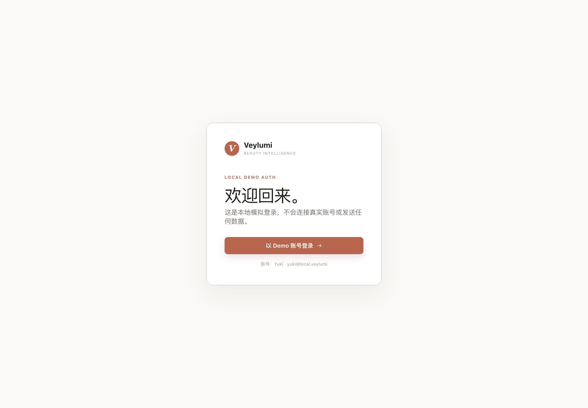

> 登录是本地 mock（`authenticated: true`），真实 ChatGPT 认证尚未接入。

### 3.2 首页「为你」(For You)

登录后进入首页：问候语、推荐妆容方向（hero）、以及基于肤色/肤质/市场计算出的 3 个商品推荐。每个商品带**推荐理由**，可一键收藏。

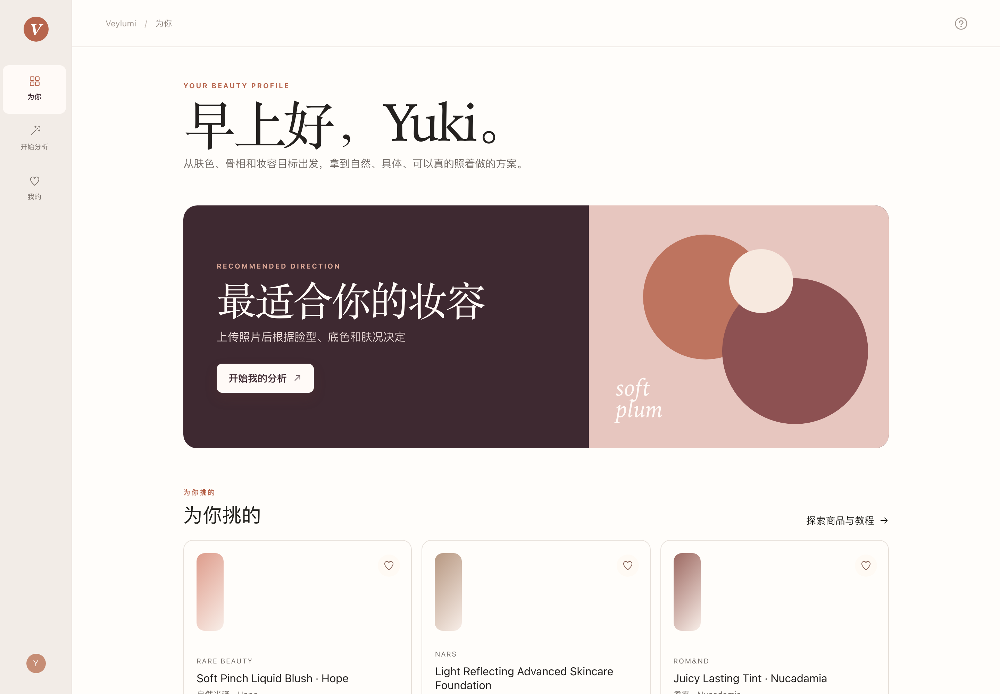

### 3.3 分析流程「开始分析」(Analyze)

**Step 01 — 上传前说明**：清晰列出照片要求（单人正脸、自然光、无滤镜）与隐私承诺。

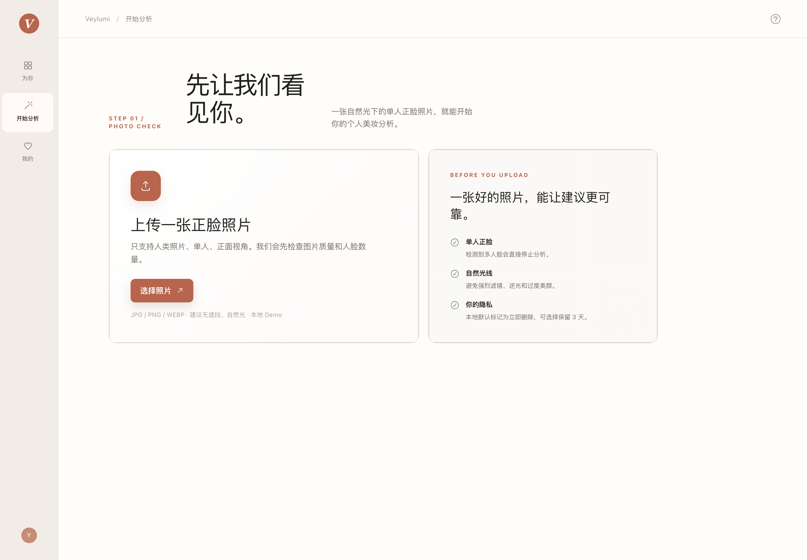

点击「选择照片」弹出上传对话框，支持 JPG/PNG/WEBP、≤10MB。

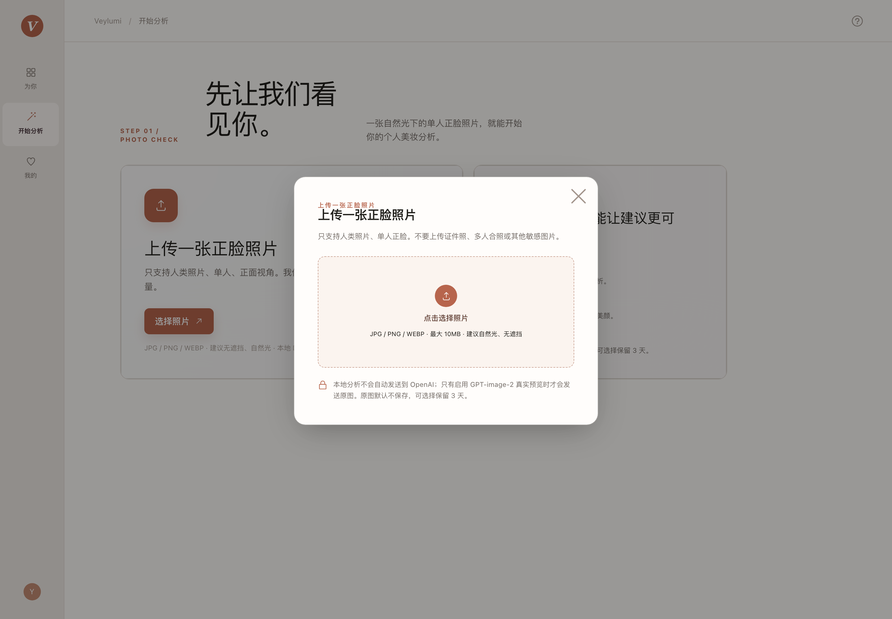

**Step 02 — 分析中**：上传后进入异步处理状态，前端通过 SSE（Server-Sent Events）等待分析完成，失败自动回退轮询。

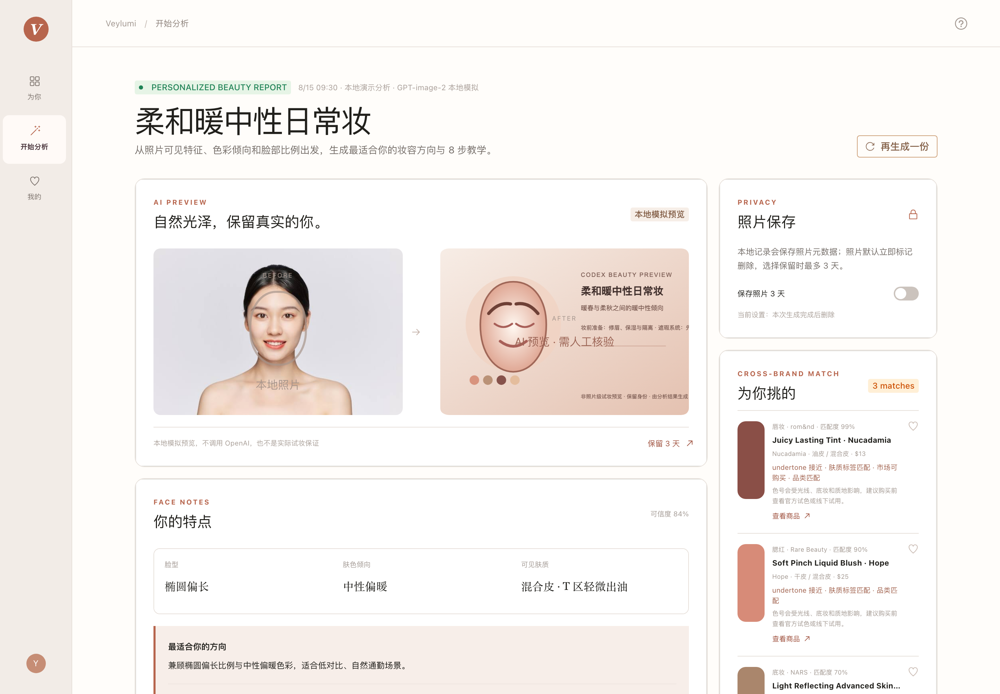

**Step 03 — 完整报告**：这是 Veylumi 的核心页面，包含：

- **Before / After 对比**：左侧原图（本地预览），右侧 AI 生成的妆后预览（无 OpenAI key 时是明确标记的本地模拟预览）。
- **面部观察指标**：脸型、肤色倾向、可见肤质。
- **妆容方向**：推荐最适合的妆容 + 置信度 + 注意事项。
- **8 步妆容计划**：从妆前准备到定妆，每步有动作与用量。
- **商品匹配**：跨品牌匹配合适色号，带推荐理由，可收藏。
- **关联教程**：按风格/肤质匹配的 YouTube 教程。
- **隐私面板**：照片保留策略开关（默认不保存，可选保留 3 天）。


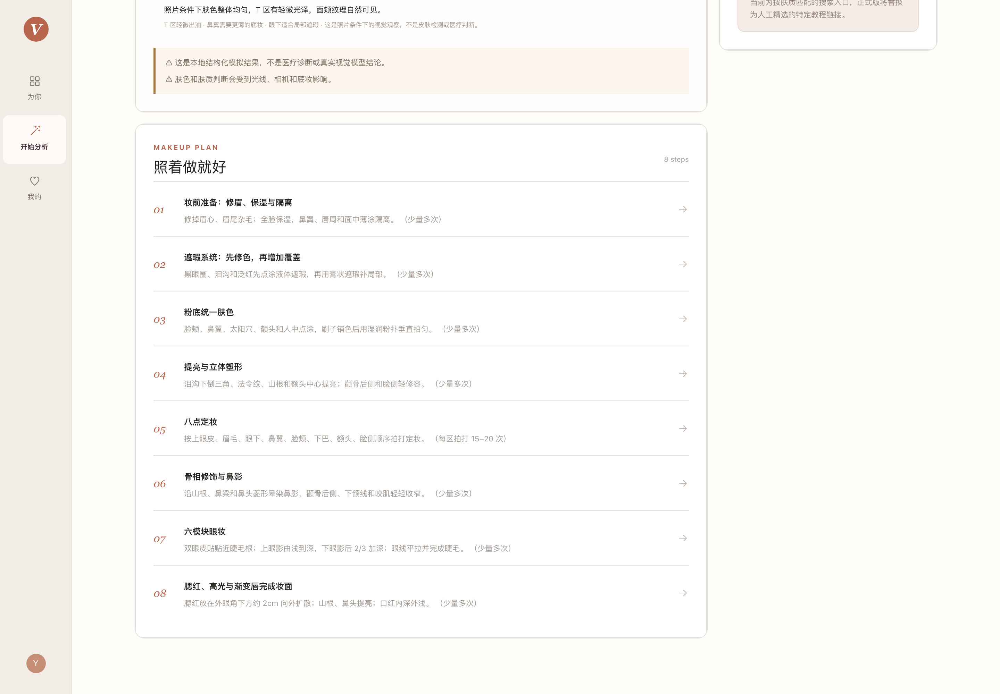

### 3.4 商品库「商品与教程」(Library)

从首页「探索商品与教程」进入。以某件商品为参考，按肤色、肤质、地区筛选出**相近色号与替代品**，并解释匹配依据。下方是练习教程入口。

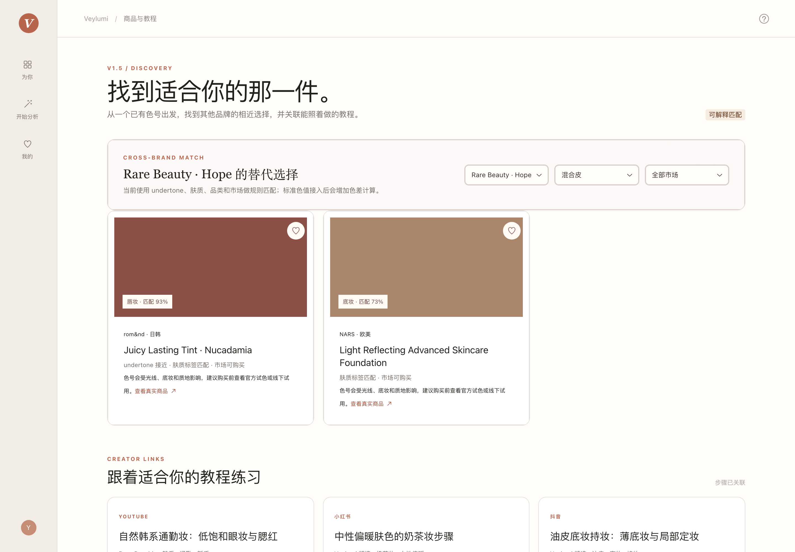

### 3.5 「我的」(Me)

历史与收藏的入口页。

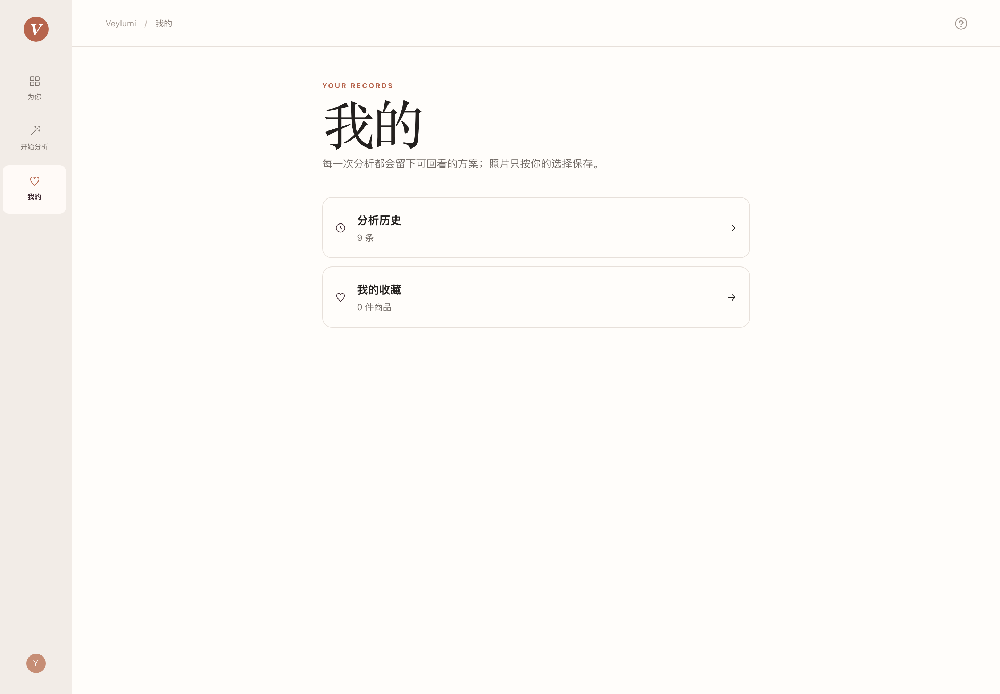

**分析历史**：按时间列出所有分析记录，可点开重新查看报告；每条记录显示反馈计数。

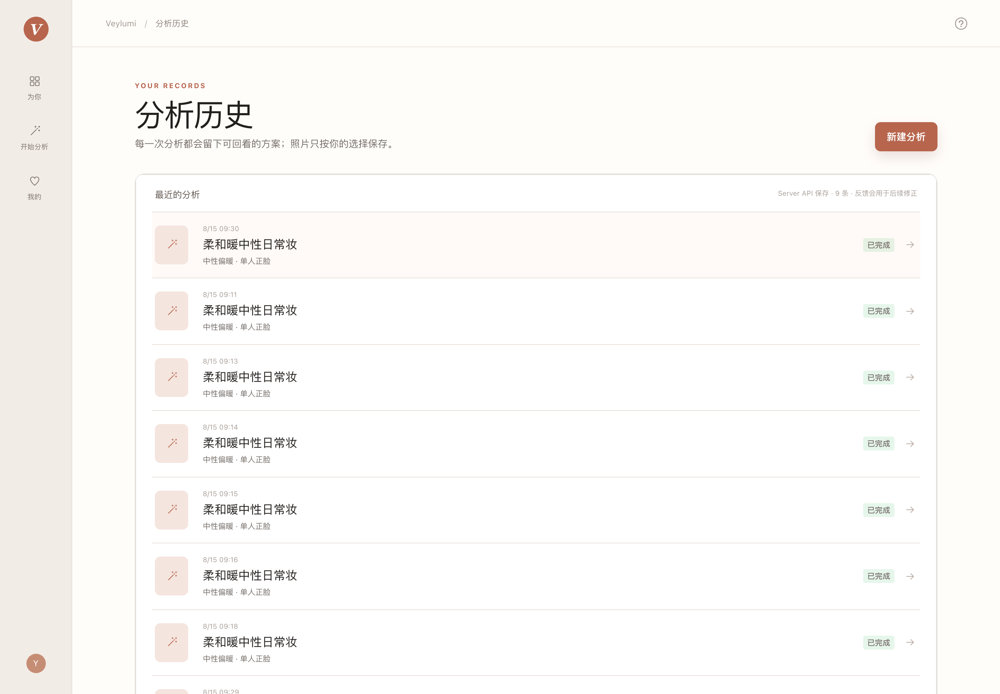

**我的收藏**：收藏的商品以卡片展示，可直接跳转购买链接。

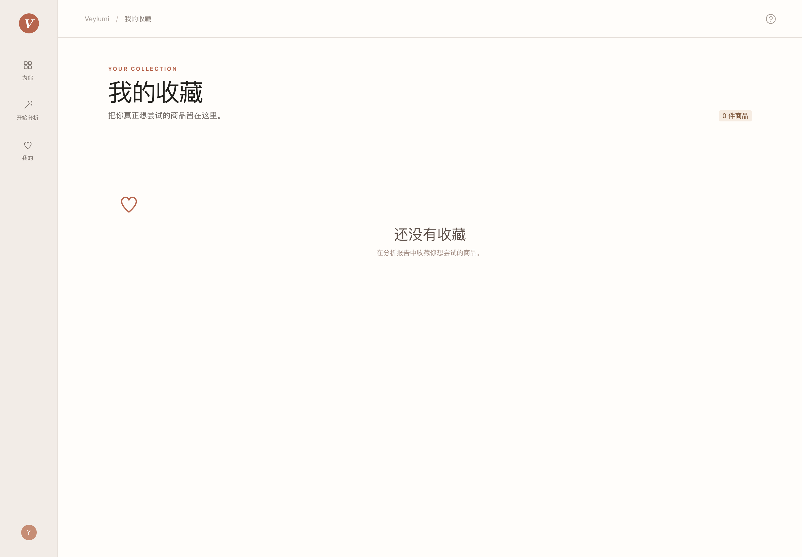

### 3.6 用户设置

从账号菜单进入。可设置昵称、邮箱、市场（中国大陆/美国海外）、语言、肤质、底色，以及**「默认保留照片 3 天」**等偏好。

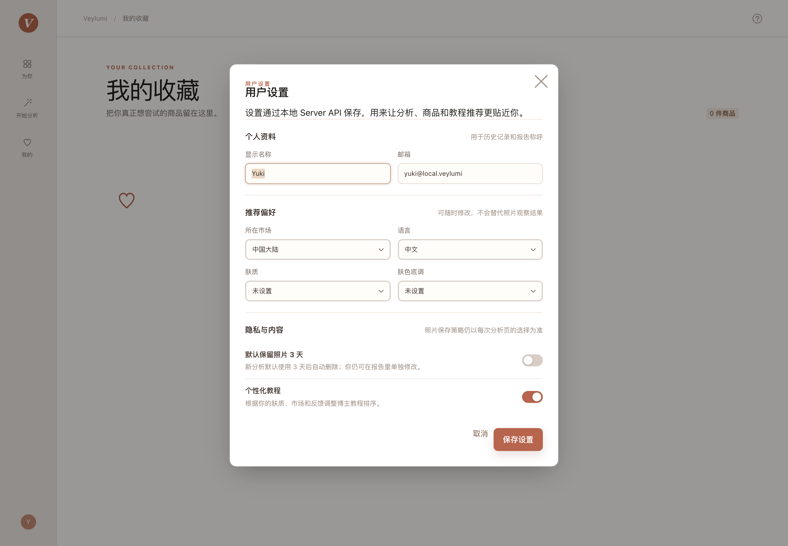

### 3.7 英文界面

界面支持中/英文双语（266 个语义 key 双语言覆盖，见 `packages/i18n/locales/`）。下面是通过 API 将语言切到 `en-US` 后的真实渲染效果：

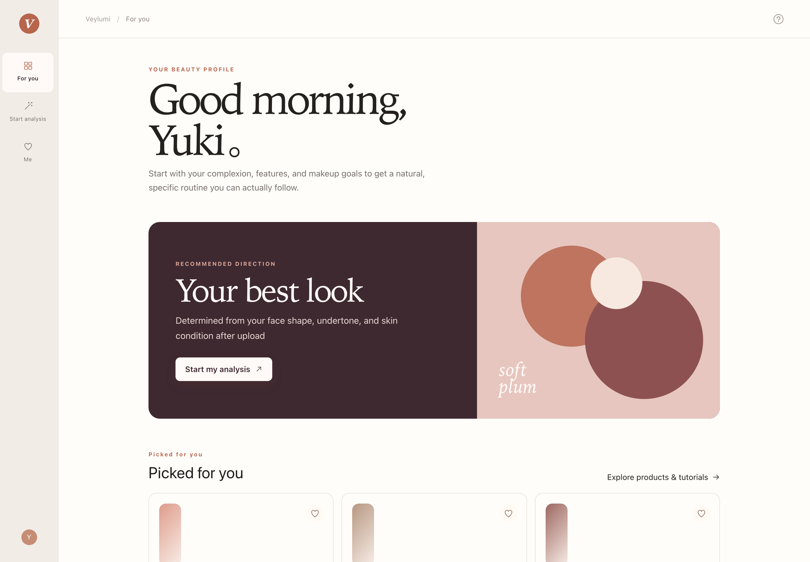

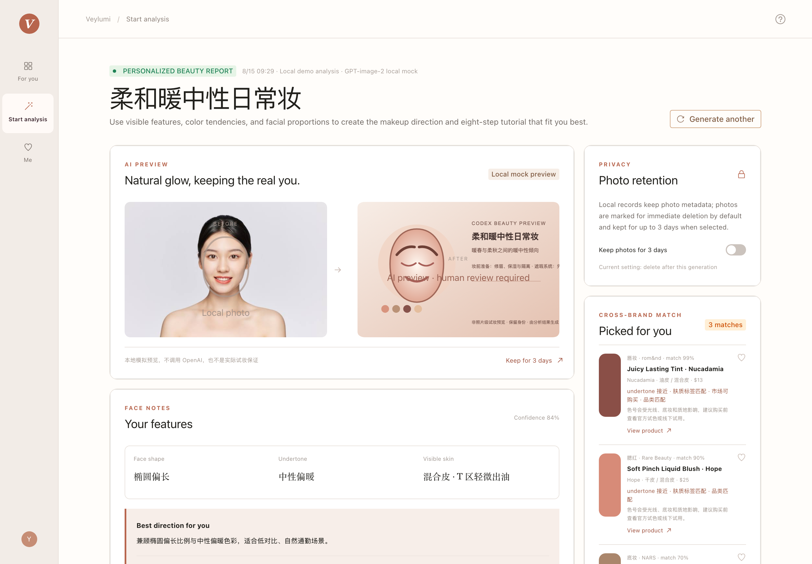

> **⚠️ 已知问题**：当前 Web 端的语言切换入口有缺陷——侧边栏「中 / EN」按钮被 CSS 隐藏，设置弹窗改语言保存后不生效，真实 UI 暂时无法在 Web 上切到英文（上面截图经 API 直改得到）。移动端原生 UI 不受影响。排查过程见 [附录 A](#11-附录-a已知问题与排查)。

### 3.8 运维控制台 `/admin`

独立的管理员页面：请求量、错误率、平均延迟、推荐服务状态、错误码分布、路由热度与请求日志。demo 模式下 admin token 默认 `local-admin`。

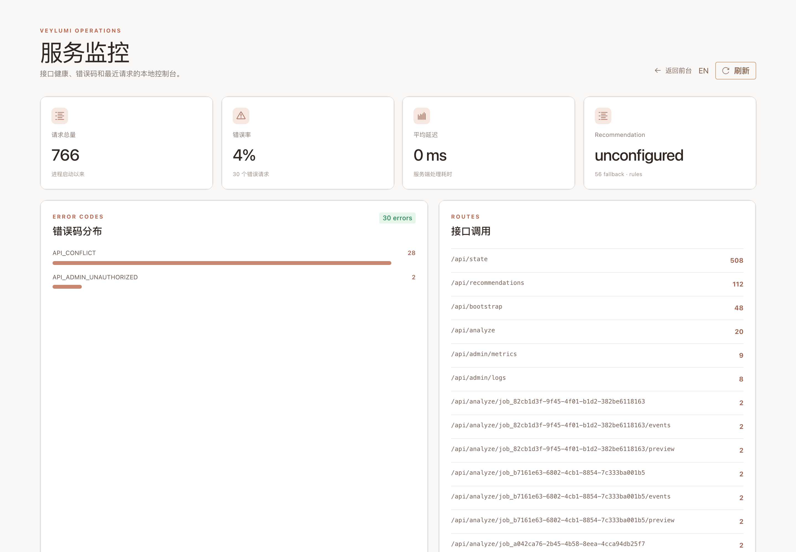

### 3.9 移动端响应式

侧边栏在窄屏下变为**底部导航**（For You / Analyze / Me），核心流程在手机上同样可完成。

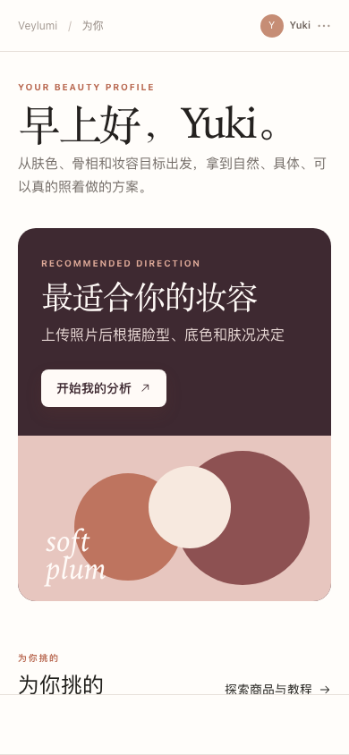

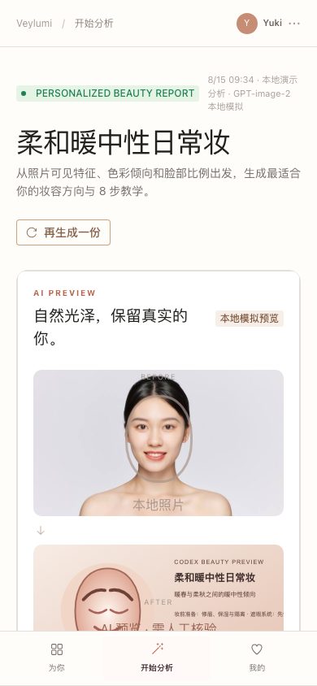

---

## 4. 架构与代码组织

### 4.1 仓库拓扑（Monorepo）

```
veylumi/
├── apps/                        # 三端客户端
│   ├── web/                     # Web 前端（React + Vinext + Radix Themes）
│   ├── ios/                     # iOS 原生（SwiftUI，7 个源文件）
│   └── android/                 # Android 原生（Kotlin + Jetpack Compose，7 个源文件）
├── services/                    # 后端服务
│   ├── api/                     # 本地 Server API（Node，REST + SSE + JSON repository）
│   ├── recommendation/          # 独立部署的推荐服务（私有网络，仅被 API 调用）
│   ├── worker/                  # Cloudflare Worker 入口（Web 托管/边缘）
│   └── database/                # D1 数据库边界（当前 schema 为空，预留）
├── packages/                    # 跨端共享契约与资源
│   ├── api-contract/            # OpenAPI + 生成的 TypeScript 契约
│   ├── client-contract/         # API 地址、上传/轮询限制
│   ├── recommendation-contract/ # 推荐规则（候选资格、基础评分权重）
│   ├── catalog/                 # 商品与教程目录（唯一数据源）
│   ├── domain/                  # 可复用的业务模型（分析结果、用户设置）
│   ├── i18n/                    # 语义 key + 中英文翻译 → 三端平台资源
│   ├── design-tokens/           # 设计 token → 三端平台资源
│   └── ui-spec/                 # 组件语义与可访问性下限
├── docs/                        # 文档（本文档、PRD、TRD、设计系统等）
├── tests/                       # 单元测试 + E2E
└── demo/                        # 示例照片（face.jpeg，用于联调）
```

### 4.2 数据流

```
浏览器（apps/web）
  │  fetch + Bearer token（demo 下经 /api/bootstrap 匿名获取）
  ▼
本地 Server API（services/api/server/local-api.mjs）
  ├─ /api/state           读写整库快照（乐观锁 If-Match + 409 冲突合并）
  ├─ /api/state (PATCH)   命名操作：toggleSavedProduct / updateSettings / addFeedback
  ├─ /api/analyze         上传图片 → 异步任务队列（返回 jobId）
  ├─ /api/analyze/:id     查询任务状态
  ├─ /api/analyze/:id/events   SSE 完成通知
  ├─ /api/recommendations 推荐（转调独立 recommendation 服务或回退规则）
  └─ /api/catalog/...     商品与教程目录
```

**关键设计**：页面**默认不用浏览器 localStorage 存业务数据**，全部走 Server API；API 不可用时默认显示连接错误，不回退到浏览器存储。这保证了「未来换 Postgres/D1 只换 Repository 实现」的迁移路径（`local-repository.mjs` 是存储边界）。

> **例外：纯静态版**。GitHub Pages 部署的静态演示（`npm run build:static`）是零后端形态，数据落在访问者浏览器 localStorage，分析用固定 fixture。它由 `apps/web/app/static-adapter.ts` 实现，与 `server-api.ts` 共享同一契约；本地起前端但没起后端时也会自动降级到它（见 README「纯静态版」一节）。业务数据的主路径仍遵循上面的设计。

**并发安全**：`/api/state` 用 `If-Match` revision 做乐观锁；冲突（409）时前端自动拉取最新状态，按集合做并集合并（`mergeDb`）后重试。E2E 第 9 条专门验证了多标签并发不丢数据。

### 4.3 推荐架构

`services/api` 是唯一公网入口；`services/recommendation` 独立部署、只走**私有网络**。公网 endpoint `GET /api/recommendations` 带有限定超时与短缓存，推荐服务故障时降级为**共享规则回退**——计算服务不可用 ≠ 应用不可用。

隐私边界：推荐请求**不含**用户标识、邮箱、反馈原文、照片与生成预览，只含妆容上下文、目录候选与聚合信号。

当前实现为 `rules-v1`：确定性候选过滤 + 规则排序。演进路径：事件聚合 → 离线模型训练 → 模型注册表 →（评估证实收益后）向量/GPU 推理。

---

## 5. 数据模型与存储

本地 MVP 使用 **JSON repository**（`services/api/server/local-repository.mjs`）作为轻量数据库，数据文件默认 `.data/veylumi.json`（不提交仓库）。

### 顶层结构

```ts
{
  version: 1,
  revision: number,          // 乐观锁版本号
  authenticated: boolean,
  user: MockUser,            // displayName / email / createdAt
  savedProductIds: number[],
  analyses: AnalysisRecord[], // 报告 + 结果 + 照片资源引用
  photos: PhotoAsset[],       // 照片元数据 + 保留策略 + 到期时间
  feedback: RecommendationFeedback[], // 偏黄/偏深/偏干/偏油/不适合
  settings: UserSettings,     // 语言/市场/肤质/底色/默认保留3天
}
```

### 照片生命周期（隐私核心）

| 策略 | 行为 |
| --- | --- |
| `immediate`（默认） | 分析完成后立即标记 `deletedAt`，不落库 |
| `3d` | 用户主动选择保留，`expiresAt` = 当前 + 72 小时，到期清理 |

每次应用启动执行过期清理（`purgeExpiredPhotos`）。**照片二进制从不写入 JSON 数据库**——生产实现应替换为对象存储 + 到期任务 + 不可恢复删除，数据库只存元数据。

---

## 6. AI 分析链路

### Provider 抽象

| Provider | 说明 |
| --- | --- |
| `local-mock` | 固定 fixture，零延迟，用于完整链路模拟与联调 |
| `codex`（默认） | 本机 Codex CLI 执行 JSON 分析 |
| `gpt-image-2`（图像） | 照片级 AFTER 预览，需 `OPENAI_API_KEY`；无 key 时 demo 返回**带标记的 SVG 模拟预览** |

### 分析任务流

1. 前端读取图片为 Data URL → `POST /api/analyze`（带 `Idempotency-Key`，重复提交复用任务）。
2. Server 校验 MIME、文件签名、10MB 上限；**不把图片二进制写入数据库**，只存输入摘要。
3. 任务入队（默认单并发，`VEYLUMI_ANALYSIS_MAX_CONCURRENT` 可调）。
4. 前端用 `GET /api/analyze/:id/events`（SSE）等待完成，失败回退轮询。
5. 完成后返回：provider、结构化分析、8 步妆容计划、风格/色彩/肤况、可选 `previewImageUrl`。

### 前端人脸预检

浏览器有 `FaceDetector` API 时，上传前先做**单人正脸预检**（多人/无人直接报错）；浏览器不支持时降级为「按 demo 流程继续」并给出 warning。服务端仍会做基础校验——不能只依赖浏览器 `accept` 属性。

---

## 7. 跨平台：Web / Android / iOS

Veylumi 是**三端原生客户端 + 共享契约**的 monorepo：

- **Web**：React 19 + Vinext（Vite + RSC）+ Radix Themes + Tailwind CSS 4，部署到 Cloudflare Workers。
- **iOS**：SwiftUI，`apps/ios/Veylumi`（7 个源文件），Xcode 项目由 `xcodegen` 生成。
- **Android**：Kotlin + Jetpack Compose，`apps/android/app`（7 个源文件），Gradle 构建。

**共享边界原则**（`docs/shared-contracts.md`）：三端共享 REST API，但**不共享 UI 代码**。共享内容必须从 `packages/*` 读取，应用层不得复制：

- `api-contract` → OpenAPI / 错误 envelope / 状态 operation
- `catalog` → 商品与教程目录
- `client-contract` → API 地址、上传限制、轮询限制
- `recommendation-contract` → 候选资格、基础评分权重
- `i18n` / `design-tokens` / `ui-spec` → 语义 key、设计 token、组件规范（生成各平台资源）

移动端从 `packages/i18n` 生成的平台资源读文案，从 `packages/design-tokens` 读设计 token，UI 用平台原生组件实现但遵循 `ui-spec` 的可访问性与交互下限。

> **当前限制**：原生端是「依赖轻、契约共享」的骨架——Web 功能最全；iOS/Android 覆盖核心页面（Overview / Analyze / Library / Me / Report / Settings）并共享 REST 契约，但照片级预览、人脸预检等 Web 专有能力尚未完整移植。原生构建需要完整 Android SDK/Gradle 与 Xcode，本仓库不会携带这两个工具链的构建产物。

### 原生端截图

iOS 原生 App 在模拟器上的运行效果（SwiftUI Overview 页，数据来自本地 API）：

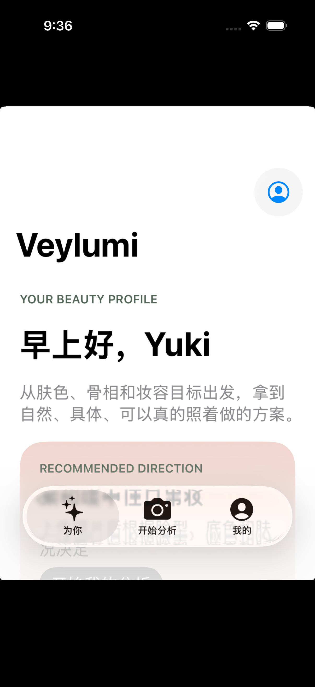

---

## 8. 设计系统

`docs/design-system.md` 定义了完整规范，核心要点：

- **分层**：Radix Themes（交互组件 + 可访问性基础）+ Veylumi 品牌层（`apps/web/app/brand.css`，独立维护）。
- **品牌规则**：暖白画布、陶土色（terracotta）是**唯一**主行动色；8px 间距体系（4/8/12/16/24/32/48/64）；圆角只用 8/12/20，胶囊仅用于标签状态。
- **排版**：Display 64 / 页题 44 / 章节 28 / 卡片 18 / 正文 14 / 元信息 12；正文不得低于 12px，细体不用在关键信息。
- **组件词汇**：`Button` `Card` `Badge` `Select` `Tabs` `Dialog` + 产品模式 `ProductCard` `TutorialCard` `AnalysisMetric` `PhotoPreview`。

`DEVELOPMENT.md` 记录了硬性约束：不引入第二套 UI 库、不使用硬编码颜色、新组件必须消费 `--veylumi-*` token、每次 UI 改动后必须 `npm run build` 并在浏览器验证。

---

## 9. 测试与质量保障

### 单元测试（Node `node --test`）

覆盖 API 契约、任务队列、输入校验、图片 provider 路由、状态合并、推荐规则、i18n key 完整性、渲染结果等 17 个测试文件。

### E2E（Playwright，`tests/e2e/app.spec.ts`）

10 条串行用例覆盖核心链路：

1. 启动就绪且无连接错误
2. 默认登录，可退出并重登
3. 上传 → 分析 → 完整报告（SSE 全链路）
4. 收藏商品并可在收藏页看到
5. 反馈被记录到历史计数
6. 历史列表可重开报告
7. 报告页保留 3 天开关真实落库
8. 设置默认保留 3 天影响下次上传
9. **多标签并发保存不丢数据**（revision merge）
10. 超大文件（>10MB）被拒绝且不进分析

---

## 10. 当前状态与路线图

### 已完成

- ✅ **在线静态演示**：[liyuk.github.io/veylumi](https://liyuk.github.io/veylumi/) —— 零后端纯静态版，push 到 main 自动构建发布到 GitHub Pages（见 [README「纯静态版」](../README.md#纯静态版github-pages)）
- ✅ 三端 monorepo（Web 全功能；iOS/Android 契约共享骨架）
- ✅ 五个产品板块成型：AI 分析、商品系统、推荐、外链跳转、教学视频，覆盖「上传 → AI 分析 → 8 步妆容计划 → 商品匹配 → 教程 → 历史/收藏」完整闭环
- ✅ 照片隐私生命周期（默认不保存 / 可选 3 天）
- ✅ 双语言 i18n（266 key × 2）、设计 token、跨端共享契约
- ✅ 本地 Server API（REST + SSE + 乐观锁冲突合并）+ 独立推荐服务网关
- ✅ 运维控制台、观测（请求/错误率/路由/日志）
- ✅ 17 个单测文件 + 10 条 E2E

### 待接入（明确未做）

- 真实 ChatGPT 认证（当前为本地 mock 登录）
- Cloudflare D1 数据库 / R2 对象存储 / 定时删除任务
- 正式商品数据同步
- 照片级 AI 预览的生产化（当前依赖 OpenAI key，无 key 走 mock）
- 推荐服务的模型训练阶段

### 产品愿景（尚未进入范围）

- **社区氛围**：将教程从「单向内容」沉淀为「收藏、分享、讨论」的社区体验，让用户互相学习、沉淀经验。当前由人工精选的教程与商品页承担这部分体验，社区功能尚未实现（PRD 明确不自动抓取小红书/抖音/Instagram 等平台内容）。

### 文档索引

| 文档 | 内容 |
| --- | --- |
| [PRD v1](PRD-v1.md) | 产品需求 |
| [TRD v1](TRD-v1.md) | 技术需求 |
| [本地数据模型](local-data-model.md) | JSON 数据结构与照片生命周期 |
| [本地 API 与存储](local-api.md) | 端点、鉴权、队列、图像 provider |
| [跨端共享边界](shared-contracts.md) | 三端共享契约与规则 |
| [推荐架构](recommendation-architecture.md) | 推荐服务部署拓扑与演进 |
| [设计系统](design-system.md) | 品牌 token、排版、组件规范 |
| [组件架构](component-architecture.md) | 组件边界与重构规则 |
| [Monorepo 迁移](monorepo-migration.md) | 仓库布局与边界 |
| [V2 预留范围](V2-frozen.md) | 明确不做的事 |

---

*截图由脚本 `docs/screenshots/capture.mjs` 驱动本地 dev server（local-mock 模式）生成；所有截图均来自真实运行中的应用。*

---

## 11. 附录 A：已知问题与排查

本节记录正文只给出结论、需要完整来龙去脉的问题。

### A.1 Web 端语言切换失效（2026-08-15 实测）

**现象**：Web 上无法通过界面把语言切到英文——侧边栏底部的「中 / EN」按钮在 editorial shell 布局下被 CSS 隐藏（`globals.css` 第 95 行 `.language-button { display:none }`），不可见、不可点；设置弹窗内的语言下拉选择后保存不生效。

**排查**：draft 已更新为 `English`（React fiber 可确认），但保存后的 `POST /api/state` 提交的语言仍是旧值（`zh-CN`），刷新后界面仍为中文。请求序列显示：保存后先有 `GET /api/state`（拉回远程旧值）再发 `POST`，疑似 `fetchDb` effect（依赖 `copy` → 依赖 `db.settings.language`）在 debounce 保存前用远程状态覆盖了本地刚做的修改——与 `tests/e2e/app.spec.ts` 第 7 条注释提到的「mergeDb 回滚」为同一类竞态。

**影响**：上面 §3.7 的两张英文截图是通过 API 直改 `settings.language` 得到的，真实 UI 当前无法在 Web 上切换到英文。移动端原生 UI 直接读 `packages/i18n` 生成的资源，不受此问题影响。

**建议**：修复设置弹窗的保存链路——保存后先 `POST` 再拉取，或让 `fetchDb` 依赖收敛到不受语言选择影响的字段。

---

## 12. 从项目介绍到动手

到这里，你应该已经知道 Veylumi 是什么、能做什么。接下来按需深入：

- **想亲手跑起来** → [第 2 章](#2-快速上手本地跑起来)：两条命令启动本地 API 与前端，demo 模式无需任何 key。
- **想改前端 / 看界面逻辑** → [`apps/web`](../apps/web)（`app/page.tsx` 是主入口）+ [设计系统](design-system.md)。
- **想看接口与 AI 链路** → [本地 API 与存储](local-api.md)、[数据模型](local-data-model.md)。
- **想了解整体架构** → [第 4 章](#4-架构与代码组织) 与 [Monorepo 迁移](monorepo-migration.md)。
- **想知道哪些事明确不做** → [V2 预留范围](V2-frozen.md)。

技术选型速览（详见正文）：**Web** React 19 + Vinext + Radix Themes + Tailwind 4；**iOS** SwiftUI；**Android** Kotlin + Jetpack Compose；**后端** Node Server API + 独立推荐服务；**AI** Codex / GPT-image 双 provider 抽象；**存储** JSON repository（预留 D1/R2）。
